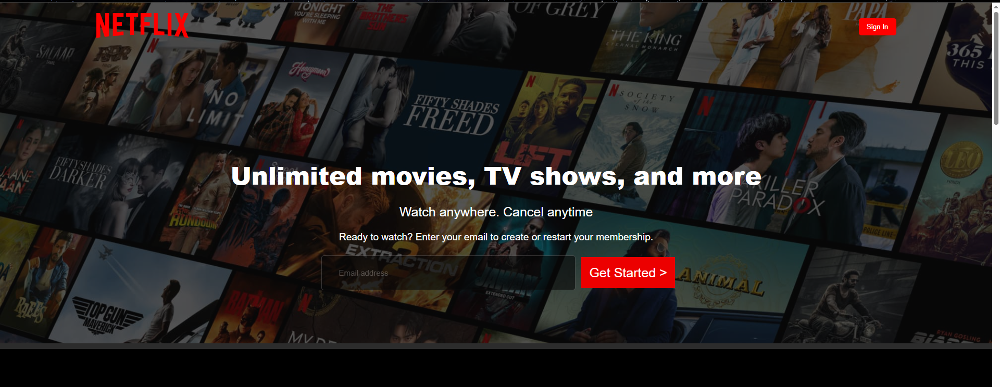

# Netflix Clone (HTML + CSS)

This is a simple Netflix landing page clone built using only **HTML** and **CSS**. It replicates the look and feel of the official Netflix home screen with static content, responsive layout, and visually styled sections.

## Features

- Full-screen background image with overlay blur  
- Responsive navbar with logo and sign-in button  
- Hero section with input field and call-to-action  
- Informative content blocks with images, text, and embedded video  
- FAQ section styled as dropdown boxes (static)  

## Technologies Used

- HTML5  
- CSS3 (Flexbox, Grid, Positioning)

## Screenshots

## How to Use

1. Clone or download this repo  
2. Place the required image and video files inside the `Assets/Images` and `Assets/Videos` folders  
3. Open `index.html` in a browser  

> Note: This is a static front-end project. No functionality or backend is implemented.

## License

This project is for educational/demo purposes only.
